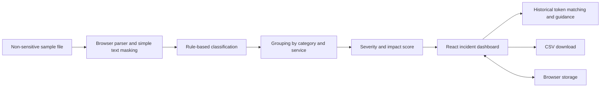

# LogMind AI


LogMind AI is a hackathon project that demonstrates one possible log-triage workflow. The current implementation is a browser-based prototype with sample workspaces, local file parsing, rule-based incident grouping and ranking, and historical case matching.

<p align="center">
  <a href="#what-it-does-today">What it does today</a> ·
  <a href="#run-locally">Run locally</a> ·
  <a href="#how-the-prototype-works">How it works</a> ·
  <a href="#proposed-pipeline">Proposed pipeline</a>
</p>

---

## At a glance

| | |
|---|---|
| **Project** | LogMind AI · Hackathon project #8 |
| **Current form** | Client-side React prototype |
| **Input** | Plain text and JSON Lines, up to 10,000 non-empty lines per file; use sample data only |
| **Repository** | [XYZ-4444/LogMind-Ai](https://github.com/XYZ-4444/LogMind-Ai) |

## The problem

During an operational incident, thousands of timestamped events can make it difficult to see what failed first, which services are affected, and what to investigate next. LogMind is designed to help turn that stream into a ranked set of incident summaries with timestamps, affected services, supporting log evidence, and suggested checks.

The presentation uses a 10,000-line incident as an illustrative scenario. The current parser's 10,000-line cap is only an input limit; it is not a throughput or performance benchmark.

## What it does today

- **Upload local logs** — parse plain text or JSON Lines in the browser, with a limit of 10,000 non-empty lines per file.
- **Inspect and filter events** — search by message, service, severity, trace ID, category, and time range.
- **Group related errors** — classify common database, payment, authentication, API, and network messages, then group by category and service.
- **Prioritize incidents** — calculate a transparent score from severity, event volume, affected services, recent error acceleration, customer-facing paths, and duration.
- **Review historical matches** — compare normalized message tokens against resolved sample cases and show the match factors and evidence.
- **Investigate with context** — view incident timelines, related logs, affected services, notes, assignments, and next-step checklists.
- **Explore service health** — summarize health from the selected demo logs; this is not a live infrastructure probe.
- **Export incident reports** — download filtered incident summaries as CSV.
- **Explore separate demo workspaces** — switch among ShopSphere, CloudNova, and SecureGate sample organizations.

### How recommendations are presented

Recommendations are rules-based prototype guidance. A historical match is shown as a retrieval score, not a probability that a diagnosis or fix is correct. The app includes the supporting historical and current log messages, and asks the engineer to verify proposed steps; it does not apply changes automatically.

## Run locally

### Requirements

- Node.js and npm
- Git

### Start the development server

```bash
git clone https://github.com/XYZ-4444/LogMind-Ai.git
cd LogMind-Ai
npm ci
npm run dev
```

Open the local address printed by Vite. The development server binds to `127.0.0.1`.

### Build and preview

```bash
npm run build
npm run preview
```

The production build is written to `dist/`. To run the repository's Node test suite, use:

```bash
npm test
```

## Explore the demo

On the sign-in screen, select **Enter interactive demo**. The source code also contains public mock credentials for the guided demo; they are not real accounts, and must never be treated as a security boundary or reused in a deployed system. Workspace and session changes are saved in browser storage.

## How the prototype works



1. **Parse:** Read non-empty lines from a local file. The parser extracts or infers timestamp, severity, service, message, and trace ID fields from plain-text or JSON Lines input.
2. **Normalize and classify:** Lowercase and normalize messages for matching, masking common variable values for comparison. A small set of message patterns classifies known error categories.
3. **Group:** Group warning and higher-severity events using category and service keys. Unclassified messages are grouped by normalized message and service.
4. **Rank:** Score each group using visible factors such as its highest severity, number of related entries, affected services, recent error rate, payment or authentication indicators, and duration.
5. **Investigate:** Compare the current group with resolved cases in the same workspace using token overlap, service, and category. Show matches and evidence for an engineer to review.
6. **Save and report:** Keep workspace state in browser storage and allow CSV exports from the report view.

## Proposed pipeline

The project pitch and architecture graphic describe a possible future pipeline. The image is a concept illustration only; none of its embedding, clustering, cross-service correlation, dependency mapping, or SLO-aware analysis stages are implemented in the current prototype. The 60-second figure shown in the image is an unmeasured target, not a result or commitment.


The proposed stages are:

1. **Semantic normalization and privacy filtering** — parse logs into a shared schema and redact sensitive values before analysis.
2. **Semantic grouping** — encode messages with a sentence embedding model and cluster similar errors, instead of relying only on handcrafted categories.
3. **Cross-service correlation** — connect clusters using trace IDs, time windows, and service dependency information.
4. **Impact ranking** — combine severity, error acceleration, service criticality, and SLO or error-budget impact into an incident priority.
5. **Evidence-led investigation support** — show the ranked incidents, evidence, and suggested checks while keeping engineers responsible for diagnosis and action.

The illustration names Sentence-BERT and HDBSCAN. They are ideas in the pitch, not dependencies configured in this repository. The current app uses local pattern classification, per-service grouping, heuristic priority scoring, and token-overlap historical matching.

## Technology

| Area | Current prototype |
|---|---|
| UI | React 19, JavaScript, CSS |
| Development and build | Vite 6 |
| Charts | Recharts |
| Icons | Lucide React |
| Parsing and analysis | Browser-side JavaScript rules |
| Persistence | Browser `localStorage` and `sessionStorage` |

The project presentation proposes a possible backend using Python and FastAPI, regex parsing, Sentence Transformers with clustering, an LLM API for explanations, and Chart.js/Firebase for visualization and storage. These are pitch-stage options, not dependencies or services configured in the current repository.

## Repository layout

```text
LogMind-Ai/
├── index.html
├── package.json
├── vite.config.js
├── public/
├── scripts/
│   └── build-standalone.mjs
├── src/
│   ├── App.jsx             # App shell, navigation, and overview
│   ├── components.jsx      # Shared interface and charts
│   ├── engine.js           # Parsing, grouping, scoring, and demo data
│   ├── investigation.jsx   # Logs, incidents, history, and solutions
│   ├── management.jsx     # Reports and workspace settings
│   ├── main.jsx            # Browser entry point
│   ├── storage.js          # Browser session and workspace persistence
│   └── styles.css
└── tests/
    ├── engine.test.js
    ├── render.mjs
    └── storage.test.js
```

## Data handling and current limits

- Use fictional or otherwise non-sensitive sample files only. Do not upload production logs, credentials, secrets, personal data, or confidential information.
- Files are parsed in the browser; the project has no ingestion server. Browser-local processing does not make the app secure or suitable for sensitive information.
- The parser has a 10,000 non-empty line limit per file. This limit does not establish a processing-time guarantee.
- A simple pattern masks some values following labels such as `password`, `secret`, `api_key`, and `token`, plus bearer tokens. This can miss sensitive values; it is not a privacy or security control. Do not rely on it to make real logs safe to upload.
- Browser storage is not secure authentication, encrypted storage, or tenant isolation. Other people with access to the browser profile may inspect it.
- Cloud collectors and database monitoring shown in the interface are simulations. No external account or integration is connected.
- The app does not call Gemini, OpenAI, or another external AI service.
- Service health is inferred from the selected sample or uploaded logs, not live probes.

## Project materials and attribution

The supplied project presentation names the team as **Pixels**; confirm that attribution with the project maintainers before treating it as formal or current. The repository does not list individual contributors. See the [GitHub contributor graph](https://github.com/XYZ-4444/LogMind-Ai/graphs/contributors) for repository activity. No deployed demo URL is included in the supplied project materials; add one here if the maintainers publish a deployment.
